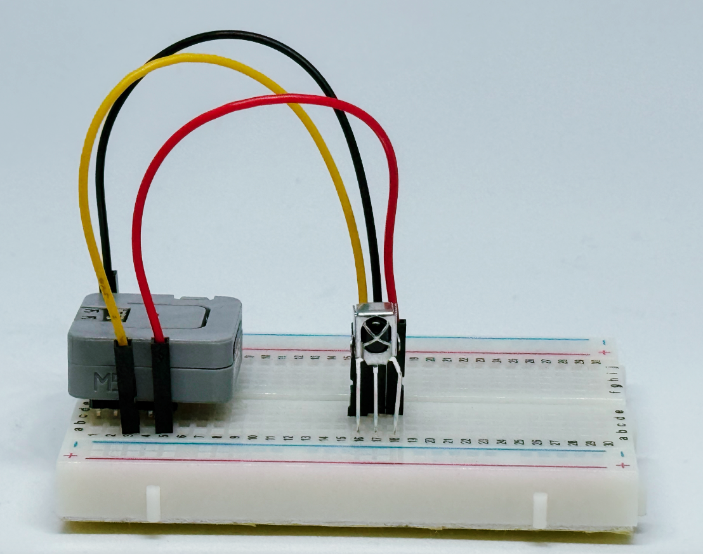
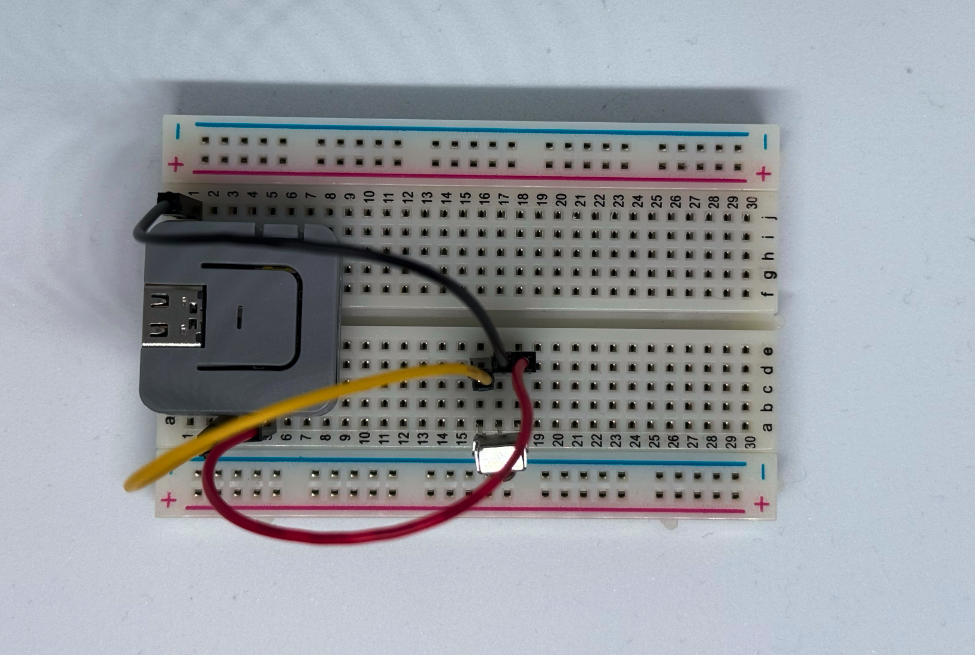
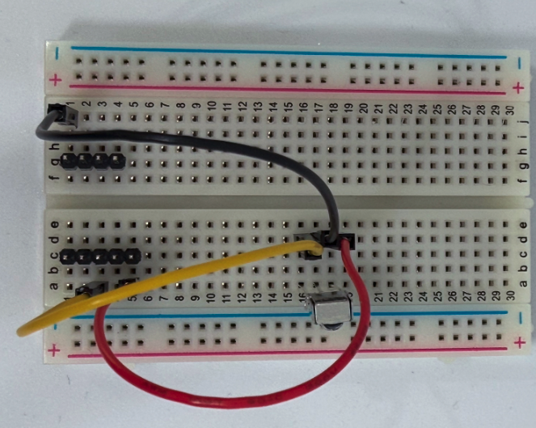

# M5Atom IR Receiver Example

このリポジトリは、M5Atomデバイスを使った赤外線(IR)受信のサンプルコードを含んでいます。

## ディレクトリ構成

- `examples/m5atom_ir_receiver/m5atom_ir_receiver.ino`  
  M5Atom用IR受信サンプルのArduinoスケッチ
- `docs/images/sideview.png`  
  配線イメージ（側面）
- `docs/images/topview.png`  
  配線イメージ（上面）
- `docs/images/topview_m5less.png`  
  配線イメージ（M5Atomなし）

## 配線イメージ

### 側面

### 上面

### 上面（M5Atomなし）

## 配線方法

- 赤外線受信機のGNDとM5AtomのGNDを接続
- 赤外線受信機のOUTとM5Atomの19ピンを接続
- 赤外線受信機のVCCとM5AtomのVCCを接続

## 必要なもの

- [M5Atom Lite](https://ssci.to/6262)
- IR受信機（VS1838B）
- ブレッドボード
- ジャンパワイヤ（オスーオス）
- [ピンヘッダ（両端ロング）x2](https://akizukidenshi.com/catalog/g/g109055/)

## 前提条件

- Arduino IDEの初期設定が完了していること
- M5Stack用のボード設定が完了していること

## 使い方

1. Arduino IDEで`examples/m5atom_ir_receiver/m5atom_ir_receiver.ino`を開きます。
2. ライブラリマネージャからM5Atomをインストールします。
3. M5AtomをPCに接続し、スケッチを書き込みます。
4. シリアルモニタでIR信号の受信結果を確認できます。

## ライセンス

このプロジェクトはMITライセンスで公開されています。詳細は[LICENSE](LICENSE)をご覧ください。